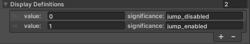
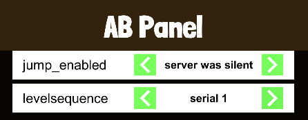

[Go Back To Main Page](../../README.md)
## “AB Test” Setup:
* Activate the wrapper
* Ad items in accordance to defined in the Max variable service (set up by Lion)
* Titles should exactly match the MAX variable
* You can disable the test for iOS or Android individually.
* You can access ab values by using `ABMan.GetValue_Int(ABtype.AB0_jump_enabled)` or similar functions. Where `0` (AB0 in example) is the serial of the auto generated enum, and `jump_enabled` is the title. 
* The display definition helps you to set up local test values, the significance text is just a text that helps you understand what this value of this setting means.
  
  
  
### Testing the “AB test” Integration:
* You can enable the AB test Panel from wrapper to investigate the integration
* The panel will let you see in your build, what value you are getting for each AB variable  from the server. If not, the variables will default to “server was silent”. (this is applicable for the first build or after cleaning data from device)
  
  
* You can apply specific values of each AB variable before starting the game. You can thus test each version of the game (A or B version… or more if applicable), and see how the experience is for each test group.
* If a value is left at “server was silent” it will assume the default value from that point. And every single value once applied will remain the same until you clear data again. (in theory you can change it from the AB panel again but that's not the case for actual users, and also in some case changing the value after being set might break the experience)

[Go Back To Main Page](../../README.md)
