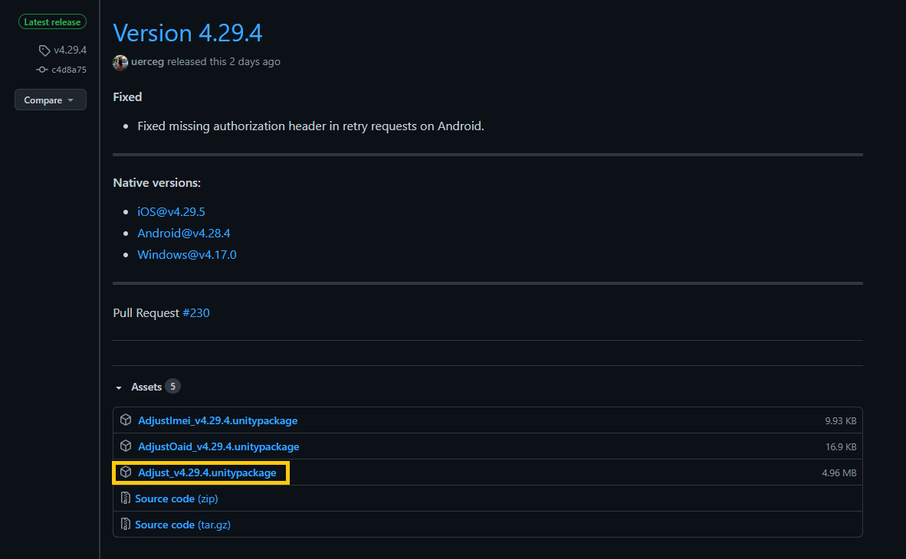
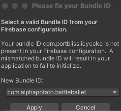
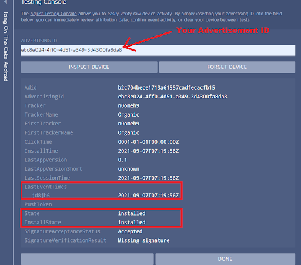

[Go Back To Main Page](../../README.md)
## Adjust Integration:
* Get the latest Adjust unity sdk from: [here](https://github.com/adjust/unity_sdk/releases/) . [tried and tested version: **4.29.3**]. Use the link as shown in the image.
  
* Activate the PotatoSDK wrapper for Adjust.
* Enter the app token for your platform/s. 
* Make sure the mode is production, not testing, before building for production.

### Testing Adjust Integration: 
#### Method 1 (If your Game is not setup at the Adjust Console)
1. You can't use this method if you have InAppPurrchase already defined for your game.
2. In your phone install the adjust insights app : [android](https://play.google.com/store/apps/details?id=com.adjust.insights&hl=en) or [iOS](https://apps.apple.com/us/app/adjust-insights/id1125517808). Run this app and keep your **Google Advertisement ID** copied.
3. Go to the adjust dashboard(icing on the cake dashboard is being used for this test) :  [android dashboard](https://dash.adjust.com/#/setup/345cj8h1np1c) or [iOS dashboard](https://dash.adjust.com/#/setup/fkj5de2klvcw).  You will need credentials from your PM. 
4. Go to the testing console 
5. Use your **Google Advertisement ID** obtained from the Adjust Insight app and click view device data. If data exists already, ask to forget the device. (if data doesn't exist it will tell you that your ID is not found)
6. In Unity PotatoSDK, Enable test mode for Adjust by clicking `Production=>Test` (might take a few seconds to apply) then build the game, install and run on your mobile device.
    * If you have firebase already in your project it might tell you to fix your bundle ID, you should cancel the prompt.(if your unity gets stuck, search for this)
      
      
    * If you have FireBase (ios) you might get this error while building. Ignore it

      
      
7. You should see:
    * "State" as "installed"
    * "InstallState" as "installed"
    * your events within "LastEventTimes" Section 
    * [see the sample snapshot below]
    
      
8. Once you are done, go to Unity and on PotatoSDK click on Test=>Production to resume production mode.

#### Method 2 (If your Game is already at the Adjust Console)

1. In your phone install the adjust insights app : [android](https://play.google.com/store/apps/details?id=com.adjust.insights&hl=en) or [iOS](https://apps.apple.com/us/app/adjust-insights/id1125517808). Run this app and keep your **Google Advertisement ID** copied.
2. Go to the adjust dashboard for your app and platform
3. Go to the **testing console** 
4. Use your **"Google Advertisement ID"** obtained from the Adjust Insight app and click view device data. If data exists already, ask to forget the device. (if data doesn't exist it  will tell you that your ID is not found)
5. Build the game, install and run on your mobile device.
6. You should see:
    * "State" as "installed"
    * "InstallState" as "installed"
    * your events within "LastEventTimes" Section
    * [see the sample snapshot below]
    
    

[Go Back To Main Page](../../README.md)
