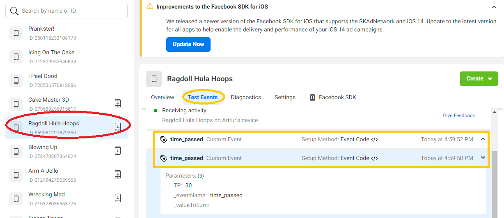

[Go Back To Main Page](../../README.md)
# Facebook Integration:
* Get the latest Facebook unity sdk from: [here](https://developers.facebook.com/docs/unity/downloads) . [tried and tested version: **11.0.0**] 
* Import the SDK, Say yes to the consent request.
* Activate PotatoSDK facebook Wrapper
* Insert facebook app id in Facebook Settings Window (Menu:  Facebook/Edit Settings). Get this id  from your FB dashboard.
* Delete and Resolve Libraries(EDM or PSR) before building.

# Testing Facebook Integration:
* To test you need to be added as a developer in the facebook dashboard, by the creator of the app in facebook. 
* Keep your facebook app logged in on your test device.
* EnableTest Analytics in your FB wrapper of PotatoSDK
* Build your app and keep it running on your device
* Check if you receive Logs in [FB Event Manager](https://www.facebook.com/events_manager2) 
    * You will need to select your app in the event manager
    * Open Tab Test Events to check live events from your device and check for events
    
* Disable Test Analytics when you are done testing

[Go Back To Main Page](../../README.md)
