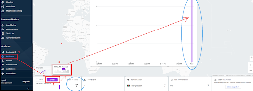

[Go Back To Main Page](../../README.md)
## Firebase Integration:
1. Get the latest FireBase unity sdk from: [here](https://developers.google.com/unity/archive#google_analytics_for_firebase) . [tried and tested version: **8.1.0, 8.3.0**] 
2. Import the SDK (Please check **Managing “External Dependency Manager(EDM)”/”Play Service Resolver(PSR)”** section for importing instruction)
3. Recommended to choose “no” when prompted **“Enable Auto Resolution?"** (you can also do this anytime by going to Assets/ExternalDependencyManager/AndroidResolver/Settings)
4. Activate PotatoSDK Firebase Wrapper
5. Obtain “google-services.json” (for ios it’s “GoogleService-Info.plist”) file from your project manager for your specific app (or ask how to get it)
6. Drop it in your Assets folder of your project
7. Restart Unity (Yes.)
8. Delete and resolve libraries

### Testing Firebase Integration:
1. EnableTest Analytics in your FireBase wrapper of PotatoSDK
2. Build and run. 
3. Goto the firebase console which was used to setup the project and select your project
4. Test it on firebase [console](https://console.firebase.google.com)
   
   

5. When you are running test analytics for a fresh game, you should see “testevent” as your top event. [sometimes you might need to restart your mobile’s wifi to see events]
6. Disable Test Analytics when you are done testing

[Go Back To Main Page](../../README.md)
