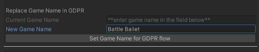

[Go Back To Main Page](../../README.md)
## “GDPR” Setup:
* Activate the wrapper
* Add partner links as instructed by PM
* Setup GDPR ui with your game name (consult PM about the name): enter the name, click the button
  
  
* GDPR is only applicable in certain countries (EU) and in case of iOS it's only applicable if the OS version is under 14.5. But you can test the flow by EnforceConsentFlow from the wrapper. When the GDPR is applicable you can check it by `GDPRMan.ConsentApplies`
* In case consent is applicable, you will need to have a settings button which will let the player access GDPR flow again. The button should call `GDPRMan.RequestGDPRFlow();`

### Testing GDPR Setup:
* You can EnforceConsentFlow to make sure gdpr flow appears the first time you run the game
* Not giving consent will cause an annoying button to appear at the top.

[Go Back To Main Page](../../README.md)
