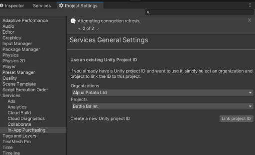
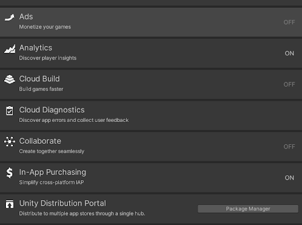
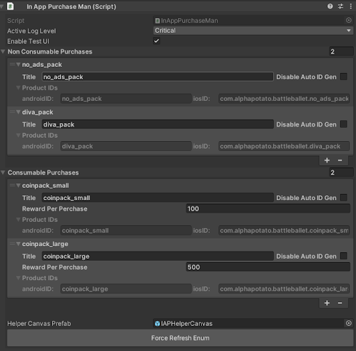
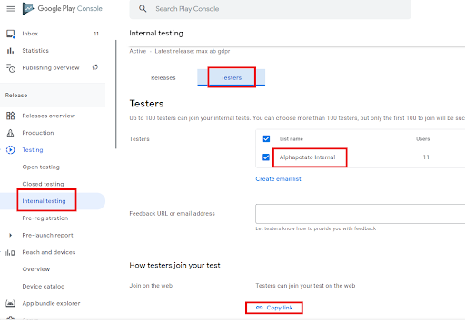

[Go Back To Main Page](../../README.md)
## InAppPurchase Integration:
* Login to unity with Company account.
* Open the services window in click “OFF” to toggle InAppPurchasing to “On”, which will take you to a Project Settings  window for now instead.
* Set organization and select “Use an existing project ID” (expected to be already set up, ask PM) . Then you will have to click the **Link project ID**.
  
  
* Going back to services now should look like the following:
  
  
* Delete resolved libraries and Resolve again (when you are done making changes to max mediated network plugins))
* Restart Unity Editor. (or do this if build fails)
* Activate PotatoSDK InAppPurchase Wrapper
* Fill up the editor according to store(playstore/appstore) data. You can setup the product ids manually if you check **Disable Auto ID Gen**, otherwise the productIDs will be auto generated using standard convention. When done click **Force Refresh Enum** 
  
  
* To make use of it, you can access any product with a function call like the following: `InAppPurchaseMan.GetProduct(PurchaseType.iap1_diva_pack)`. 
* You can use the object returned by the function to make purchase requests, or register to events like “when a specific purchase is made”.

### Testing IAP Integration:
* You can enable the test UI which will give you buttons to test your purchases.
* Google Play Store
    * You can upload your app to internal testing
    * You have to add your email on the testers list
    
      
    * Create a new release for internal testers. And roll it out for internal testing only. (if you are doing this for the first time please consult your nearest PM :P)

[Go Back To Main Page](../../README.md)
