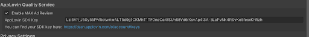

[Go Back To Main Page](../../README.md)
## MAX Integration:
* Get the latest MAX unity sdk from: [here](https://dash.applovin.com/documentation/mediation/unity/getting-started/integration).  You will need to get Applovin credentials for this from your PM. Will also require an OTP.
* Import the SDK (dont forget to uncheck **Play Services Resolver and/ External Dependency Manager** folder if you have the latest **External Dependency Manager**)
* Make sure ExternalDependencyManager/AndroidResolver/Settings has **"use jetifier"** enabled also recommended disable **“Auto Resolution “**
* Open Applovin/IntegrationManager
    * enable Max ad review and enter the sdk key: 
      
      `Lzi5VR_J50y55PM5ctwAwALT5d9g1CKMhT1TF0naOa4fSUn98Vd6rXsvAp4I3A-5LaPvNk4RSvKe5fesxKhRzh`  
      (you might want to confirm with your product manager)
      
      
    * Install all the ad network plugins that you are required to 
        * Admob: you will need additional key for admob
        * Facebook: you need to follow the following steps for facebook
            * You will need to add a new attribute `“android:networkSecurityConfig="@xml/network_security_config””` in the main Android Manifest. The new attribute should be added inside the application element at the end of the current attributes already there.  It should be something like this in the end
              ```
              <application android:theme="@android:style/Theme.NoTitleBar.Fullscreen" android:icon="@drawable/app_icon" 
              android:label="@string/app_name" android:debuggable="false" android:networkSecurityConfig="@xml/network_security_config">
              ```
            * Also you will need to move or copy  the folder named “res” inside “Assets/PotatoSDK/CopyContentsToPlugins_Android” to “Assets/Plugins/Android” with its contents
* Delete resolved libraries and Resolve again (when you are done making changes to max mediated network plugins)
* Activate PotatoSDK MAX Wrapper
* Enter ad unit id for relevant ads. (you must enter ID if you want to use that kind of ad. But you can leave it blank if you are not using)
* Use the following functions to use ads (namespace:  using PotatoSDK)
    * `MAXMan.ShowInterstitial()`
    * `MAXMan.ShowRV()`
    * `MAXMan.ShowBanner() and MAXMan.HideBanner()`
* Enable or Disable Mediation debugger in your PotatoSDK according to your build requirement (ask project manager)

#### Maintaining Interstitial Intervals:
* You can configure minimum gaps between interstitial in which calls for another interstitial will be ignored
* You can also add similar skip time for interstitials after RV completes successfully
  
* If you need to configure these values on runtime you can use the functions:
    * MAXMan.Set_MinimumInterstitialGap();
    * MAXMan.Set_InterstitialSkipTimeAfterRV();

### Testing MAX Integration:
* Enable mediation debugger (PotatoSDK => MAXMan) 
* You can enable the test UI which will give you buttons to test your ads.


[Go Back To Main Page](../../README.md)
